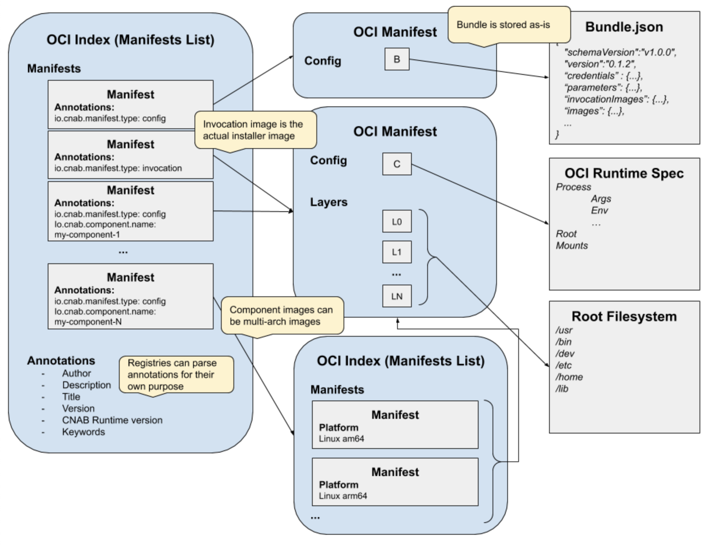

# CNAB Primer

<!-- TODO: revisit and write actual intros-->

---

## What's a CNAB Bundle?

<https://github.com/cnabio/cnab-spec/blob/main/100-CNAB.md>

> The Cloud Native Application Bundle (CNAB) is a standard packaging format for multi-component distributed applications. It allows packages to target different runtimes and architectures. It empowers application distributors to package applications for deployment on a wide variety of cloud platforms, providers, and services. Furthermore, it provides necessary capabilities for delivering multi-container applications in disconnected (airgapped) environments.
>
> CNAB is not a platform-specific tool. While it uses containers for encapsulating installation logic, it remains un-opinionated about what cloud environment it runs in. CNAB developers can bundle applications targeting environments spanning IaaS (like OpenStack or Azure), container orchestrators (like Kubernetes or Nomad), container runtimes (like local Docker or ACI), and cloud platform services (like object storage or Database as a Service).
>
> CNAB can also be used for packaging other distributed applications, such as IoT or edge computing.

## How is a CNAB bundle stored in an OCI image?



## Who created this?

> ... [Microsoft][blog-ms], [Docker][blog-docker], HashiCorp, Bitnami, [Pivotal][blog-pivotal], and many others created Cloud Native Application Bundles (CNAB). CNAB is an open source cloud-agnostic package format specification for bundling and installing distributed applications.


## :balloon: :books:  Start Here

* **required** reading! the [original Pivotal dev blog][blog-pivotal] post. :bulb:
* [github.com/cnabio/cnab-spec](https://github.com/cnabio/cnab-spec)
* Microsoft
  * <https://cloudblogs.microsoft.com/opensource/2018/12/04/announcing-cnab-cloud-agnostic-format-packaging-running-distributed-applications>
* Docker
  * <https://www.docker.com/blog/docker-app-and-cnab>
  * <https://www.docker.com/blog/docker-donates-cnab-to-oci-library>
  * <https://www.docker.com/blog/powering-docker-app-next-steps-for-cnab>
* Tanzu (previously Pivotal Labs) 
  * <https://tanzu.vmware.com/content/blog/cloud-native-application-bundles-a-simple-way-to-install-software-on-kubernetes-or-any-other-runtime>

| tool   | what it is
| ---------   | -------- 
| format | [JSON file format](https://github.com/cnabio/cnab-spec/blob/main/101-bundle-json.md).
| [duffle.sh](https://duffle.sh) | CLI. Install and manage distributed app bundles.
| [porter.sh](https://porter.sh) | CLI. Package appartifact, client tools, configuration and deployment logic together as a versioned bundle that you can distribute, and then install with a single command.

<details>
  <summary>TLDR: the CNAB JSON format</summary>

> A bundle.json is broken down into the following categories of information:
>
> The schema version of the bundle, as a string with a v prefix. This schema is to be referenced as v1 or v1.2.0
> * The top-level package information (name and version)
>     * **name**: The bundle name, including namespacing. The namespace can have one or more elements separated by a dot (e.g. acme.tunnels.wordpress). The left most element of the namespace is the most general moving toward more specific elements on the right.
>     * **version**: Semantic version of the bundle
>     * **description**: Short description of the bundle
> * Information on the invocation images, as an array
> * A map of images included with this bundle, as a component name to image definition map
> * A specification of which parameters MAY be overridden, and a reference to a validation schema
> * A list of credentials (name and desired location) that the application needs
> * An OPTIONAL description of custom actions that this bundle implements
> * A list of outputs (name, type and location) that the application produces
> * A set of schema definitions used to validate user input

</details>

[cnabspec]: https://github.com/cnabio/cnab-spec/blob/main/101-bundle-json.md

[blog-ms]: https://cloudblogs.microsoft.com/opensource/2018/12/04/announcing-cnab-cloud-agnostic-format-packaging-running-distributed-applications
[blog-docker]: https://www.docker.com/blog/docker-app-and-cnab
[blog-docker-cnab-to-oci]: https://www.docker.com/blog/docker-donates-cnab-to-oci-library
[blog-docker-cnab-next-steps]: https://www.docker.com/blog/powering-docker-app-next-steps-for-cnab
[blog-pivotal]: https://tanzu.vmware.com/content/blog/cloud-native-application-bundles-a-simple-way-to-install-software-on-kubernetes-or-any-other-runtime

### VS Code Extensions

<details>
  <summary>Duffle</summary>
   
    ```shell
    Name: Duffle
    Id: ms-kubernetes-tools.duffle-vscode
    Description: Build and deploy Cloud Native Application Bundles with Duffle
    Version: 0.3.0
    Publisher: Microsoft
    VS Marketplace Link: https://marketplace.visualstudio.com/items?itemName=ms-kubernetes-tools.duffle-vscode
    ```
    
</details>

<details>
  <summary>Duffle Coat</summary>
   
    ```shell
    Name: Duffle Coat
    Id: ms-kubernetes-tools.duffle-coat
    Description: Generates CNAB self-installers
    Version: 0.3.4
    Publisher: Microsoft
    VS Marketplace Link: https://marketplace.visualstudio.com/items?itemName=ms-kubernetes-tools.duffle-coat    ```
    
</details>

<details>
  <summary>Porter</summary>
   
    ```shell
    Name: Porter
    Id: getporter.porter-vscode
    Description: Package your application artifact, client tools, configuration and deployment logic together as a versioned bundle that you can distribute, and then install with a single command
    Version: 0.0.3
    Publisher: Porter
    VS Marketplace Link: https://marketplace.visualstudio.com/items?itemName=getporter.porter-vscode
    ```
    
</details>
